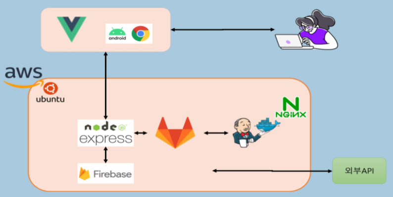
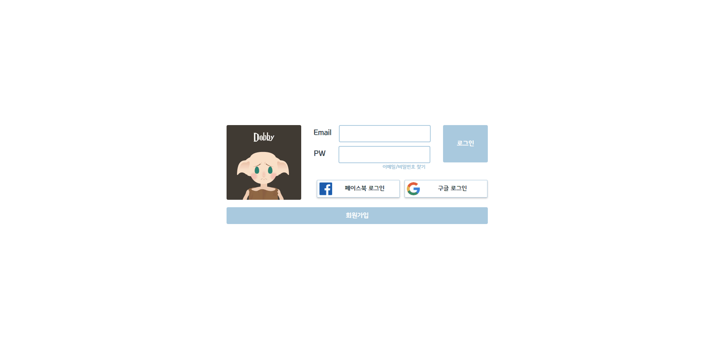
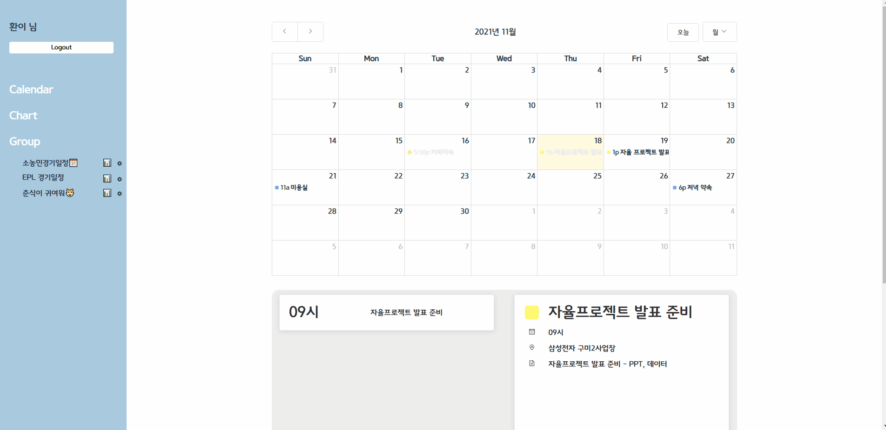
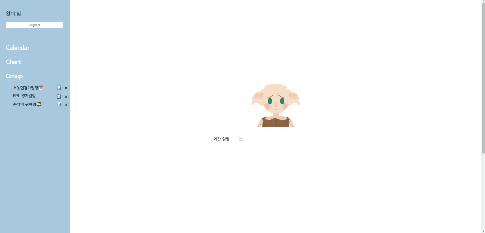

# Dobby

---


# Architecture


## 📖 기술 스택

- 언어 : c++, javascript, html

- Frontend : Vue, React-Native

- Backend : Node.js, Express

- 데이터베이스 : Firebase

- 개발툴 : Visudal studio code

- 클라우드 : AWS

- 협업툴 : GIT, JIRA

- DevOps : Jenkins, Docker, Nginx

- Library : OSRM, OSM, leaflet, FullCalendar, FCM


## 📖 기술 버전

- Nodejs : v10.19.0

- Npm : 6.14.4

- Express : 4.16.1

- firebase SDK : 9.1.3

- firebase-admin SDK : 10.0.0

- element-plus : 0.0.11

- vue : 3.0.0

- React-Native : 0.14.3

- Nginx : stable-alpine


## 💻 Installation with Local

  - 로컬에서 백엔드 실행 시 명령어

    ```shell
    # 프로젝트 디렉토리 진입
    cd backend/Dobby

    # 모듈 설치
    npm install
    # 프로젝트 실행
    npm start
    ```

  - 로컬에서 프론트엔드 실행 시 명령어

    ```shell
    # 프로젝트 디렉토리 진입
    cd frontend/Dobby

    # 모듈 설치
    yarn install

    # 프로젝트 실행
    yarn serve
    ```

  - Open Street Routing Machine (파일 용량 문제로 인해 없음)

    ```shell
    # 프로젝트 디렉토리 진입
    cd ./osrm

    ## 각각 Routing Machine을 돌려야 함.
    # osrm-test-driving : 자동차 경로
    cd osrm-test-driving/data
    # osrm-test-walking : 도보 경로
    cd osrm-test-walking/data

    # 각각 다른 포트번호로 Docker 명령어 실행
    docker run -t -i -p 5000:5000 -v "${PWD}:/data" osrm/osrm-backend osrm-routed --algorithm mld /data/berlin-latest.osrm
    ```

    * 아래의 git 가이드를 참고하여 실행 필수

      * OpenStreet Routing Machine

        git :　https://github.com/Project-OSRM/osrm-backend

# 1. Architecture

***




# 2. Project Data Structure

***

```
📦S05P31D105
├── 📂backend					# Backend 코드
│   └── 📂Dobby
│       ├── 📂bin
│       ├── 📂firebase
│       ├── 📂public
│       │   ├── 📂images
│       │   ├── 📂javascripts
│       │   └── 📂stylesheets
│       ├── 📂routes
│       │   └── 📂controller
│       └── 📂views
├── 📂frontend					# Frontend 코드
│   └── 📂vue3
│       ├── 📂nginx
│       ├── 📂public
│       └── 📂src
│           ├── 📂assets
│           ├── 📂components
│           │   ├── 📂calendar
│           │   ├── 📂map
│           │   └── 📂teleport
│           ├── 📂router
│           ├── 📂store
│           └── 📂views
│               ├── 📂calendar
│               ├── 📂chart
│               ├── 📂group
│               ├── 📂groupCalendar
│               ├── 📂main
│               ├── 📂schedule
│               └── 📂sidebar
├── 📂jenkins
├── 📂exec								# 산출물
└── 📝Readme.md
```


# 3. Firestore Data Model

***

```
🗂️ users
├── 📝user
│	├── address : String
│	├── email : String
│	├── name : String
│	├── nickname : String
│	├── phone : String
│	├── uid : String
│	└──  🗂️ calendar
│			├── 📝 calendar
│					├── cid : String
│					├── title : String
│					├── content : String
│					├── startDate : String
│					├── endDate : String
│					├── startTime : String
│					├── endTime : String
│					├── completed : Boolean
│					├── placeName : String
│					├── placeLat : String
│					├── placeLng : String
│					├── color : String
│					├── category : String
│					├── allDay : Boolean
│					├── createdAt : String
│	└──  🗂️ tokens
│			├── 📝token
│					├── tid : String
│					├── token : String
```

```
🗂️ groups
├── 📝group
│	├── gid : String
│	├── name : String
│	├── password : String
│	├── description : String
│	├── private : Boolean
│	├── uid : String
│	├── createAt : String
│	└──  🗂️ groupcalendar
│			├── 📝 calendar
│					├── cid : String
│					├── title : String
│					├── content : String
│					├── startDate : String
│					├── endDate : String
│					├── startTime : String
│					├── endTime : String
│					├── completed : Boolean
│					├── placeName : String
│					├── placeLat : String
│					├── placeLng : String
│					├── color : String
│					├── category : String
│					├── allDay : Boolean
│					├── participant : Array
│						├── uid : String
│						├── name : String
│						├── nickname : String
│						├── completed : Boolean
│					├── createdAt : String
│	└──  🗂️ members
│			├── 📝member
│					├── uid : String
│					├── gid : String
│					├── email : String
│					├── nickname : String
│					├── name : String
│					├── admin : Boolean
│					├── writer : Boolean
```


# 4. MockUp

***

- ### 피그마

  - https://www.figma.com/file/ufRXcCDDFJNebyWS6vym20/Dobby?node-id=0%3A1


# 5. Rest ApI Document

***

- ### Excel

  - https://kmuackr-my.sharepoint.com/:x:/g/personal/5294019_stu_kmu_ac_kr/EW-J6IXiI5ZDg4ZiKesCW1IBgs8oP12o45XYK9tDQ8cWsQ?e=ELVQlc


# 6. 시연

****

- ### 회원가입 및 로그인

  


- ### 개인 일정 보기 및 수정

  


- ### 그룹 일정 등록 및 수정

  


- ### 개인 및 그룹 일정 차트


